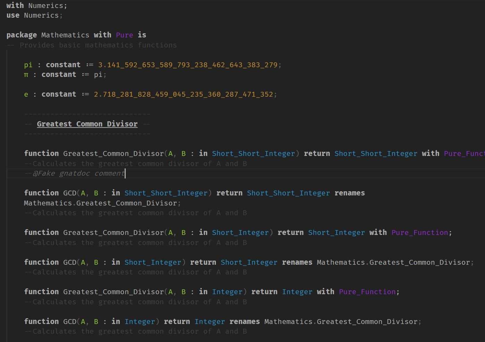
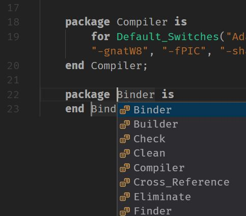

**This extension is still in development. Things may not work correctly. Things may break. The world may end.**

# About

This extension was developed largely in response to the horrible quality of Ada syntax highlighters, whether for VS Code or otherwise. It's all too apparent they were created by people who barely, if at all, work with the language.

As I've developed this, I feel like the TextMate grammar approach is very insufficient. A language server for VS Code would need to be implemented to better highlight the source code, especially for cases where RegEx will always fall short, like types within generic initializers, or function names versus type constraints. I'll still update this grammar in the meantime, until a language server can be developed.

# Features

* Highlighting for **pragmas** and **aspects**.
* Highlighting for **types**, something often missed, and as I understand it only also seen in GPS.
* Context aware highlighting, such as `return` being classed differently in function declarations versus control statements, or `exception` being classed as a keyword when introducing exception handler blocks, but as a type when declaring exceptions.
* Highlighting for `.adc` and `.gpr` files, not just `.adb` and `.ads`.
* Some snippets for `.ads`, `.adb`, `.adc`, and `.gpr` files.

# Help Me Out

Good quality extensions take a lot of time. Considerably more than just "meh, close enough" level work. If you'd like to help out but don't know how to contribute to the code, consider donating to my [Patreon](https://www.patreon.com/Entomy). Leave a message with the donation about it being for this extension, and I'll weight my work towards this.

If you're one for actually contributing, a repo is located on [GitHub](https://github.com/Entomy/Ada-vscode). Clone the repo, make your changes, and create a pull request. Assuming they meet quality standards and conventions, it will be integrated.

Sometimes I just don't see an issue with the syntax highlighter, so if you notice something not being highlighted or being highlighted wrong, please file an issue report, and include a screenshot.

# Works Best With
* [Offbase](https://marketplace.visualstudio.com/items?itemName=Entomy.offbase) although any theme will work well.

# Proofs in the Screenshot

